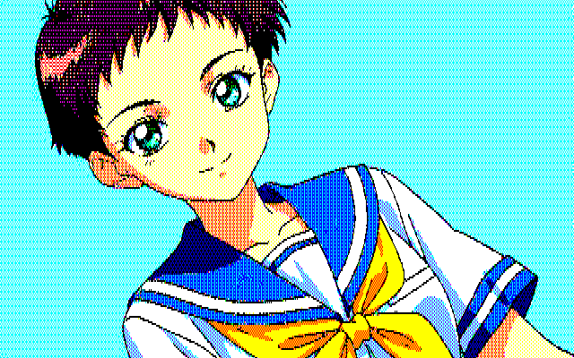
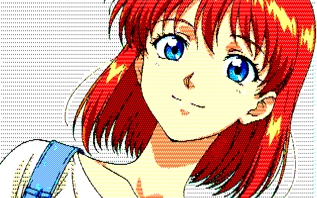
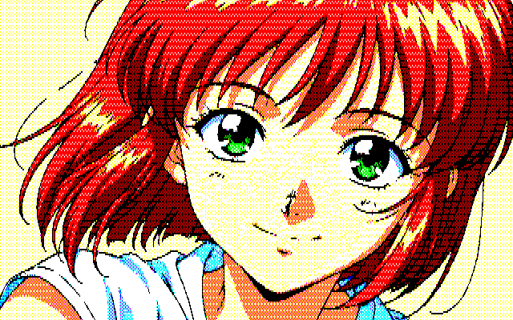

# Digital 8 / PC-9801 converters

ローカル完結のレトロPC風画像変換器です。

この公開版には、実行に必要なソース、固定パレットJSON、配布フォルダ、文書、展示用に選んだ変換例を収録しています。
開発時の解析用サンプルや資料由来の参照PNGは含めません。

- `PC-8801/`: PC-8801デジタル8色版のソースと解析ツール、[使い方](PC-8801/使い方.md)、[技術解説](PC-8801/技術解説.md)
- `PC-9801/`: PC-9801・4096色中16色版のソース、固定パレット、解析ツール、[使い方](PC-9801/使い方.md)、[技術解説](PC-9801/技術解説.md)
- `distribution/`: 配布用。実行に必要なファイルだけを含みます。

V1は従来版、V2は追加サンプルを画像単位で重み付けして解析した改良版です。通常はV2をおすすめしますが、V1も比較用に残しています。

- `distribution/PC-8801_Digital8_V1/`
- `distribution/PC-8801_Digital8_V2/`
- `distribution/PC-9801_16color_V1/`
- `distribution/PC-9801_16color_V2/`

V2の設計とV1との差は `EXPERIMENT_V2.md` を参照してください。

## V2の変換例

各行は左が入力画像、右がV2での変換結果です。PC-9801版の番号は変換時に選んだ固定パレットを示します。結果は入力画像や設定によって変わります。

<details>
<summary>PC-8801・デジタル8色（7例）</summary>

| 入力画像 | PC-8801 V2 |
| --- | --- |
|  |  |
|  |  |
|  |  |
|  |  |
|  |  |
|  |  |
|  |  |

</details>

<details>
<summary>PC-9801・4096色中16色（7例）</summary>

| 入力画像 | PC-9801 V2 |
| --- | --- |
|  | <br>パレット01 |
|  | <br>パレット02 |
|  | <br>パレット02 |
|  | <br>パレット05 |
|  | <br>パレット08 |
|  | <br>パレット02 |
|  | <br>パレット05 |

</details>

両機種のV1・V2とも、R/G/B、彩度、明度、コントラストをGUIで調整できます。
各スライダーの右側では数値を直接入力できます。色調整の結果は入力プレビューへリアルタイムに反映され、そのまま変換処理にも使われます。
「入力を横幅640pxへ縮小」を有効にすると、幅640pxを超える画像を縦横比を保って縮小してから色調整・変換します。幅640px以下の画像は拡大しません。
縮小処理には既存依存のPillowによるLANCZOSリサンプリングを使用します（Pillow: MIT-CMU License）。

各配布フォルダで、初回だけ次を実行してください。

```powershell
python -m pip install -r requirements.txt
```

その後、V1は `起動_GUI_V1.bat`、V2は `起動_GUI_V2.bat` を実行します。

## License

This project is released under the [MIT License](LICENSE).

変換例の画像は動作例の表示用であり、ソフトウェア本体のMITライセンスの対象外です。画像の権利は各権利者に帰属します。
